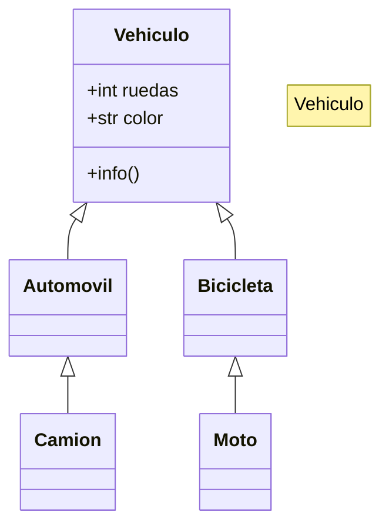

## Apuntes de programacion orientada a objetos

### Encapsulamiento 
Permite empaquetar el código dentro de una unidad (objeto) donde se puede determinar el ámbito de actuación.

### Abstraccion
Permite generalizar los tipos de objetos a través de las clases y simplificar el programa.

### Herencia
Permite reutilizar código al poder heredar atributos y comportamientos de una clase a otra.

### Polimorfismo
Permite crear múltiples objetos a partir de una misma pieza flexible de código.

## Apuntes de markdown
https://aprendepython.es/core/modularity/oop/
https://docs.github.com/es/get-started/writing-on-github/getting-started-with-writing-and-formatting-on-github/basic-writing-and-formatting-syntax

### Diagram Class
https://mermaid.js.org/syntax/classDiagram.html

### Ejercicio 2
